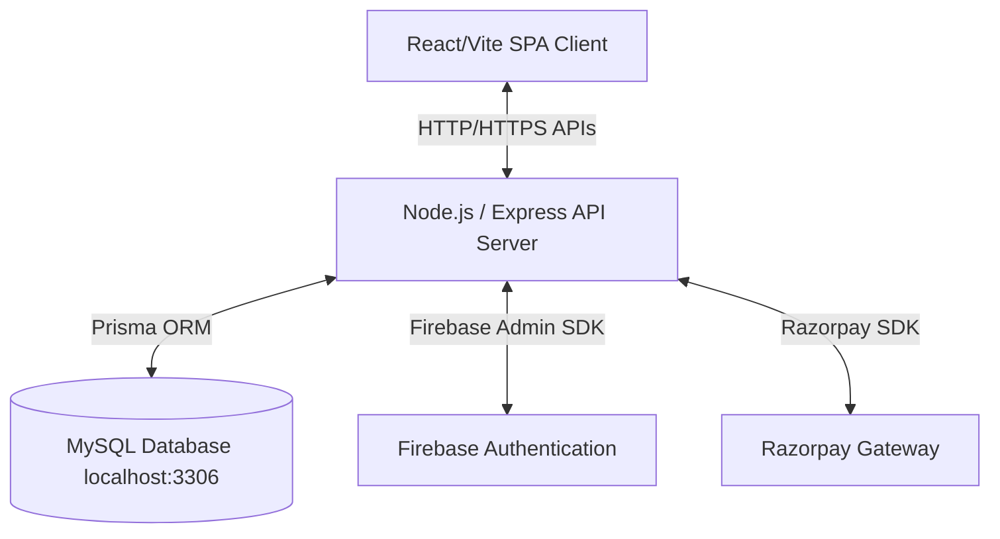

# GetHotelStays — Technical Architecture & Implementation Breakdown

This document provides a comprehensive, page-by-page, and component-by-component technical blueprint of the **GetHotelStays** booking web application. It outlines the frontend framework, backend architecture, MySQL database design, security measures, and recommendations for future AI agents to continue build-out.

---

## 1. Project Overview & Architecture
**GetHotelStays** is a premium, modern hotel and hourly-stay booking web application. It allows users to search and book properties for overnight/hourly stays, while enabling hotel partners (Admins) to manage bookings, staff, and metrics, and a Super Admin to control system-wide analytics, homepage content, properties, and payouts.

### High-Level Architecture Diagram


---

## 2. Frontend Implementation (`GetHotel-Vite`)

### Tech Stack
*   **Core:** React 19, TypeScript, Vite.
*   **Styling:** Tailwind CSS (configured for modern typography, sleek gradients, and transitions).
*   **Icons & Animations:** Lucide React, Framer Motion (for smooth micro-interactions, spring transitions, and custom dropdowns).
*   **Form Management:** React Hook Form & Zod (strict validation schemas).

### Component-by-Component & Page Breakdown

#### A. Public User Pages
1.  **Homepage (`Home.tsx` & components):**
    *   **Hero Section:** Integrates dynamic titles and highlights fetched from the database, displaying a high-converting search input (destination, dates, guest options).
    *   **Trending Hotels (`TrendingHotels.tsx`):** Lists featured properties based on ranking scores (ratings/reviews).
        *   *Update:* The location-based auto-detection and city switcher dropdown have been removed to avoid complex GeoIP errors. It now displays a clean, static **"Trending Hotels"** title and a premium, circular, animated arrow link button that redirects to the general listing page.
    *   **Explore Destinations / Featured Collections:** Displays custom location links dynamically pulled from the backend configuration.
2.  **Hotels Listing (`Hotels.tsx`):**
    *   Lists all active hotels.
    *   Offers sidebar filter panels (sorting by price, ratings, hourly-stay eligibility, city filters).
3.  **Hotel Details (`HotelDetails.tsx` & `HotelDetailContent.tsx`):**
    *   Displays image carousels, verified amenities, room lists, check-in rules, FAQs, and host details.
    *   Calculates real-time pricing dynamically based on the active stay mode (Hourly vs. Nightly) and checks availability through live room queries.
4.  **Booking Checkout & Details (`Booking.tsx`, `BookingDetails.tsx`, `BookingInvoice.tsx`):**
    *   Collects guest details.
    *   Integrates Razorpay checkout on submit.
    *   Displays secure, downloadable billing invoices once payments are processed.

#### B. Super Admin Dashboard (`/admin/super`)
A high-privilege dashboard restricted to system administrators.

1.  **Overview (`AdminDashboard.tsx`):**
    *   **Stats Section:** Displays Platform Earnings (18% commission), Gross Booking Volume (GMV), Total active hotels, and Total bookings.
    *   **Conversion Intelligence:** Monitors conversion rates (Search → Booking) and checkout abandonment metrics.
    *   **Top Destinations:** Renders animated progress bars displaying location distribution of registered properties.
2.  **Property Management Tab (`AdminDashboard.tsx` & `AdminHotelDetails.tsx`):**
    *   **Hide / Show from Search:** Admins can suspend a hotel directly from the dashboard. This toggles the database `isActive` column. If false, the hotel is automatically hidden from public search, homepage grids, and listings. Button labels are styled as **"Hide Hotel from Search"** and **"Show Hotel to Search"** for clear operational intent.
    *   **Permanent Deletion:** Irreversible deletion wizard. Requires the Super Admin to type the exact hotel name to confirm. Behind the scenes, the backend performs a transaction-safe cascade query to erase all associated staff, rooms, coupons, bookings, transactions, and reviews.
    *   **Hotel Joining Date:** The UI displays the exact database entry timestamp (`createdAt`) representing when the property registered on the platform, alongside the owner's details.

---

## 3. Backend Implementation (`GetHotel backend`)

### Tech Stack
*   **Server Framework:** Node.js, Express.
*   **Database ORM:** Prisma Client (interacts with MySQL).
*   **Environments:** Dotenv-managed environment files.

### Key API Endpoints
*   `GET /api/hotels`: Returns all active hotels (`where: { isActive: true }`).
*   `GET /api/hotels/search`: Searches hotels by destination, filters inactive properties, and calculates guest occupancy.
*   `GET /api/hotels/trending`: Returns a maximum of 12 trending hotels marked as `isTrending: true` and `isActive: true`.
*   `GET /api/admin/hotels`: (Protected) Admin endpoint returns all hotels (including inactive/hidden ones) for dashboard management.
*   `PUT /api/admin/hotels/:id/suspend`: Toggles a hotel's active/hidden state (`isActive: true / false`).
*   `DELETE /api/admin/hotels/:id`: Triggers cascade deletion of the property.

---

## 4. SQL Database Schema & Design

### Schema Overview (Prisma Model Relations)
```prisma
model User {
  id        Int      @id @default(autoincrement())
  name      String
  email     String   @unique
  role      String   @default("user") // "user", "hotel_admin", "super_admin"
  createdAt DateTime @default(now())
  hotel     Hotel[]
}

model Hotel {
  id                    Int       @id @default(autoincrement())
  name                  String
  tagline               String?
  description           String    @db.Text
  city                  String
  address               String
  pricePerNight         Double
  starRating            Int       @default(3)
  guestRating           Double    @default(0)
  reviewCount           Int       @default(0)
  thumbnail             String?   @db.LongText
  images                String?   @db.LongText // JSON array of links
  isFeatured            Boolean   @default(false)
  isTrending            Boolean   @default(false)
  isActive              Boolean   @default(true) // Suspends or hides the hotel
  userId                Int
  user                  User      @relation(fields: [userId], references: [id])
  room                  Room[]
  booking               Booking[]
  createdAt             DateTime  @default(now())
}

model Room {
  id            Int      @id @default(autoincrement())
  name          String
  maxOccupancy  Int
  pricePerNight Double
  hotelId       Int
  hotel         Hotel    @relation(fields: [hotelId], references: [id])
}

model Booking {
  id            Int      @id @default(autoincrement())
  guestPhone    String?
  checkIn       DateTime
  checkOut      DateTime
  totalPrice    Double
  paymentStatus String   @default("pending") // "pending", "paid"
  status        String   @default("confirmed") // "confirmed", "cancelled"
  hotelId       Int
  hotel         Hotel    @relation(fields: [hotelId], references: [id])
}
```

---

## 5. Security Measures Implemented

### A. Authentication & Authorization
*   **Firebase Integration:** The frontend authenticates via Firebase. The backend decodes and verifies Firebase JWT tokens on every restricted request.
*   **Role-Based Access Control (RBAC):** Custom middlewares `protect` and `authorize` check if the decoded user matches the required role (`super_admin` or `hotel_admin`) before allowing execution of admin APIs.

### B. Input Validation & Database Protection
*   **SQL Injection Protection:** Prisma Client enforces parameterized queries natively, ensuring malicious inputs in parameters can never manipulate the SQL query structure.
*   **Express Validator:** Incoming body keys (such as email structures, phone counts, and price limits) are explicitly formatted and rejected on error.

### C. Server-Level Protections
*   **Helmet:** Secures Express headers to block clickjacking, MIME sniffing, and script injection.
*   **XSS Clean:** Automatically strips scripts and HTML entities from incoming string requests.
*   **HPP:** Protects the backend against HTTP Parameter Pollution attacks.
*   **Express Rate Limit:** Restricts IPs to prevent automated brute-force attempts on sensitive pathways.

---

## 6. Known Server Issues & Recommendations for Future Agents
If you are another AI agent working to improve this system, please pay attention to the following details:

1.  **Phusion Passenger / Alternate Alt-Node Node_Modules Location (Stale Client):**
    *   *Issue:* In cPanel cloud environments using CloudLinux `alt-nodejs`, the Prisma library generates its engine to the virtual env global folder rather than the local application `node_modules`.
    *   *Fix:* Run `/home/vgyuvmpi/nodevenv/gethotel_backend/20/bin/node node_modules/prisma/build/index.js generate` explicitly on updates, and ensure the app loads the correct schema.
2.  **Cascade Database Constraints on Deletion:**
    *   *Issue:* Standard MySQL foreign keys block deletions of hotels if child tables (such as Bookings or Transactions) reference them.
    *   *Implementation:* We resolved this by executing a manual cascade wrapper utilizing Prisma's `$transaction` inside `deleteHotel`. Ensure that any new child tables (e.g. loyalty logs) are added to this transaction array to prevent deletion failures.
3.  **Image Optimization:**
    *   *Recommendation:* High-resolution Unsplash URLs are currently stored. Implementing a storage hook to compress or generate optimized thumbnails through Cloudinary/S3 before database saving will boost load speeds on list grids.
